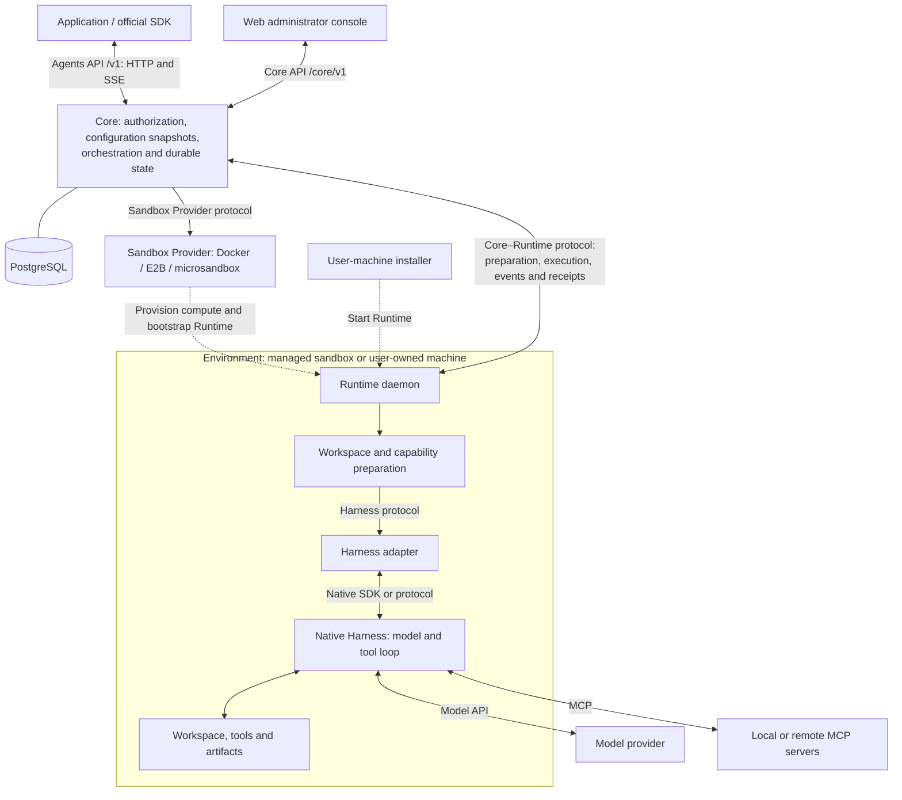

OpenAgentCore separates orchestration, compute and native execution. Core owns the API and durable state. Sandbox Providers manage compute. Independent workspace filesystem adapters manage durable Environment storage through a separate protocol. A Runtime daemon prepares an Environment and runs the selected Harness, whose native SDK or protocol owns the model and tool loop.

Dashed arrows show provisioning and installation. Solid arrows show component interactions, including in-process interfaces. The daemon initiates its authenticated WebSocket connection to Core. The [API index](./api/index.md) describes the application, operator and machine namespaces; [protocol boundaries](https://github.com/MiniMax-AI/OpenAgentCore/blob/main/AGENTS.md#protocols-at-every-boundary) lists each protocol's code and owning document.

## Component responsibilities

| Component | Responsibility | Reference |
| --- | --- | --- |
| Core | Authenticate callers, resolve and freeze configuration, schedule Turns, handle cancellation and pending interactions, persist resources and execution facts in PostgreSQL | [Core service](https://github.com/MiniMax-AI/OpenAgentCore/blob/main/services/core/README.md) |
| Sandbox Provider | Create, observe, renew and reclaim compute; supply Runtime startup input | [Sandbox Provider](./sandbox-provider.md), [Runtime bootstrap](./runtime-bootstrap.md) |
| Workspace filesystem adapter | Create, observe and delete durable Environment storage; validate and resolve its compute attachment | [Workspace filesystem providers](./workspace-provider.md) |
| Sandbox node | Operate a Docker or microsandbox host and reconcile its assigned generation and allocations | [Sandbox node protocol](../contracts/agents-api/node-generation-protocol.md) |
| Runtime | Prepare the workspace and capabilities, manage Session Executors, execute Turns and report events and receipts | [Core–Runtime protocol](./runtime-protocol.md) |
| Harness adapter | Validate native configuration, invoke the upstream SDK or protocol, translate events and confirm native cleanup | [Harness onboarding](../contracts/agents-api/harness-onboarding.md) |
| Model provider | Serve the model protocol selected for the Harness | [Model execution](../contracts/agents-api/model-execution.md) |
| Web | Let administrators configure and observe the installation through a server-side Core API connection | [Console server](./web/console-server.md) |

The [repository map](./development.md#repository-map) locates these components. [Concepts](./concepts.md) explains Project boundaries, administrator authority and tool isolation.

## A Session, end to end

An application creates a Session through the Agents API. Core resolves its configuration and execution location. A managed Session obtains compute through the selected Sandbox Provider; a self-hosted Session waits for the user to run its installation command. A Session with `environment: none` uses a connected execution device without a workspace. The [application guide](./api/public-agent-api.md#create-a-session) describes these choices.

After the daemon connects, Core checks the available Harness and requested capabilities. The Runtime prepares a workspace Environment and its capability snapshot, then prepares or reuses the Session Executor. Each Turn runs through the native Harness. Core persists the output, tool interactions and receipts for application reads and events. Completion or cancellation settles the Turn; a healthy Executor can serve the next Turn in the same Environment.

Execution, compute and independent workspace storage have separate lifetimes. Closing an Executor does not itself delete storage. The [workspace filesystem contract](./workspace-provider.md#lifetime-and-filesystem-scope) owns persistent storage retention and explicit deletion; compute checkpoint expiry does not authorize its reclamation. Preparation, connection and execution readiness have distinct states. The [Environment contract](../contracts/agents-api/environments.md) owns preparation, and the [Core–Runtime protocol](./runtime-protocol.md) owns ordering, receipts and failure handling.
