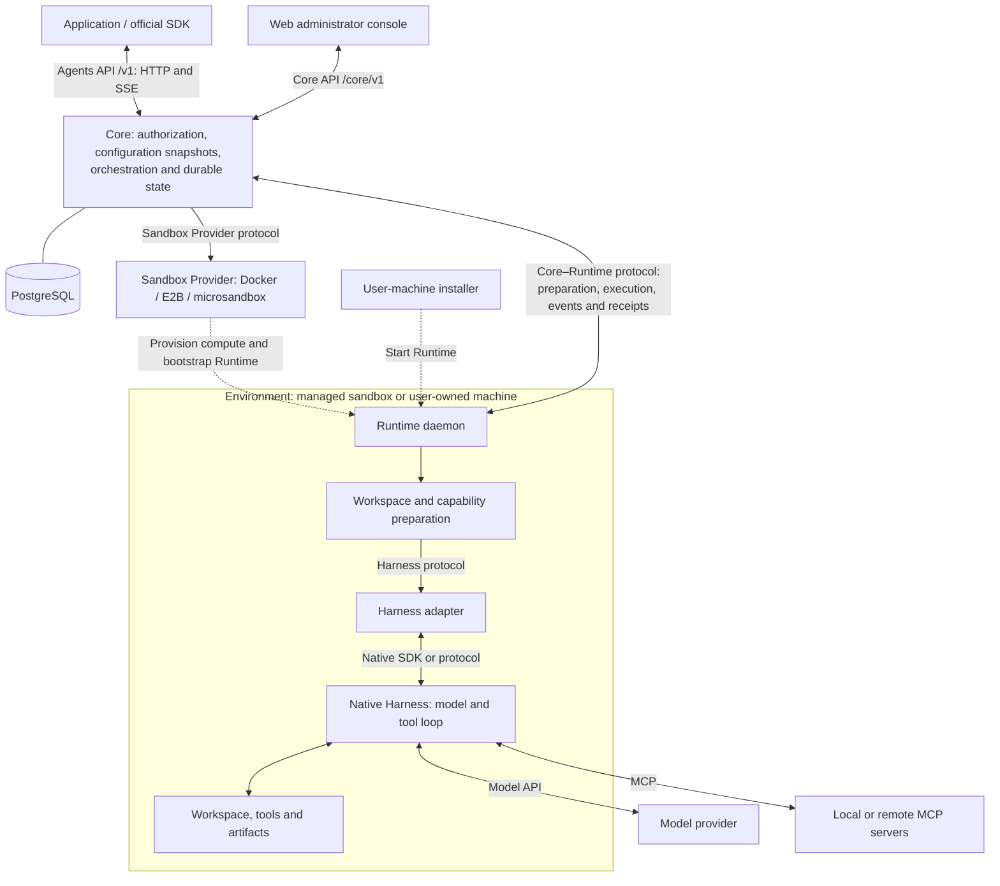

OpenAgentCore 将编排、计算资源和原生执行分开。Core 负责 API 和持久状态。Sandbox Provider 管理计算资源。独立工作区文件系统 adapter 通过单独的协议管理 Environment 持久存储。Runtime daemon 准备 Environment 并运行选定的 Harness；Harness 的原生 SDK 或协议负责模型与工具循环。

虚线表示资源供应与安装。实线表示组件交互，包括进程内接口。daemon 主动向 Core 发起经过认证的 WebSocket 连接。[API 索引](api/index.md) 说明应用、运维和机器命名空间；[协议边界](https://github.com/MiniMax-AI/OpenAgentCore/blob/main/AGENTS.md#protocols-at-every-boundary) 列出各协议的代码和所属文档。

## 组件职责 {#component-responsibilities}

| 组件 | 职责 | 参考 |
| --- | --- | --- |
| Core | 认证调用方，解析并冻结配置，调度 Turn，处理取消和待处理交互，将资源与执行事实持久化到 PostgreSQL | [Core 服务](https://github.com/MiniMax-AI/OpenAgentCore/blob/main/services/core/README.md) |
| Sandbox Provider | 创建、观察、续期和回收计算资源；提供 Runtime 启动输入 | [Sandbox Provider](sandbox-provider.md)、[Runtime 引导](runtime-bootstrap.md) |
| Workspace filesystem adapter | 创建、观察和删除 Environment 持久存储；验证并解析计算资源所需的挂载 | [工作区文件系统 Provider](workspace-provider.md) |
| Sandbox node | 运行 Docker 或 microsandbox 主机，协调分配给它的 generation 与 allocation | [Sandbox node 协议](../../contracts/agents-api/zh/node-generation-protocol.md) |
| Runtime | 准备工作区和能力，管理 Session Executor，执行 Turn 并报告事件与回执 | [Core–Runtime 协议](runtime-protocol.md) |
| Harness adapter | 验证原生配置，调用上游 SDK 或协议，转换事件并确认原生清理完成 | [Harness 接入](../../contracts/agents-api/zh/harness-onboarding.md) |
| Model provider | 提供 Harness 选定的模型协议 | [模型执行](../../contracts/agents-api/zh/model-execution.md) |
| Web | 让管理员通过服务端 Core API 连接配置与观察安装实例 | [控制台服务端](web/console-server.md) |

[仓库地图](development.md#repository-map) 标出这些组件的位置。[概念](concepts.md) 解释 Project 边界、管理员权限和工具隔离。

## Session 的完整流程 {#a-session-end-to-end}

应用通过 Agents API 创建 Session。Core 解析其配置与执行位置。托管 Session 通过选定的 Sandbox Provider 获取计算资源；自托管 Session 等待用户运行安装命令。`environment: none` 的 Session 使用已连接的执行设备，不提供工作区。[应用指南](api/public-agent-api.md#create-a-session) 说明这些选项。

daemon 连接后，Core 检查可用 Harness 和请求的能力。Runtime 准备工作区 Environment 及其能力快照，然后准备或复用 Session Executor。每个 Turn 通过原生 Harness 运行。Core 持久化输出、工具交互和回执，供应用读取和接收事件。完成或取消使 Turn 结算；健康的 Executor 可以在同一 Environment 中执行下一个 Turn。

执行、计算资源和独立工作区存储拥有不同的生命周期。关闭 Executor 本身不会删除存储。[工作区文件系统契约](workspace-provider.md#lifetime-and-filesystem-scope) 负责持久存储保留及显式删除规则；计算快照到期不授权回收工作区存储。准备、连接和执行就绪具有不同状态。[Environment 契约](../../contracts/agents-api/zh/environments.md) 负责准备规则，[Core–Runtime 协议](runtime-protocol.md) 负责顺序、回执和故障处理。
